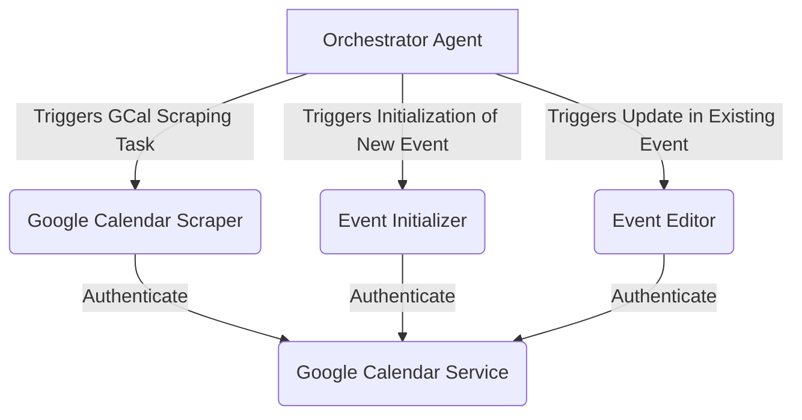

# TimeSpace-AI

The required packages needed to run TimeSpace-AI are included in the ***requirements.txt*** file.

They can be installed by using the command:

``` pip install -r requirements.txt ```

Other packages can be installed using `pip3 install ...` command.

## System Architecture

